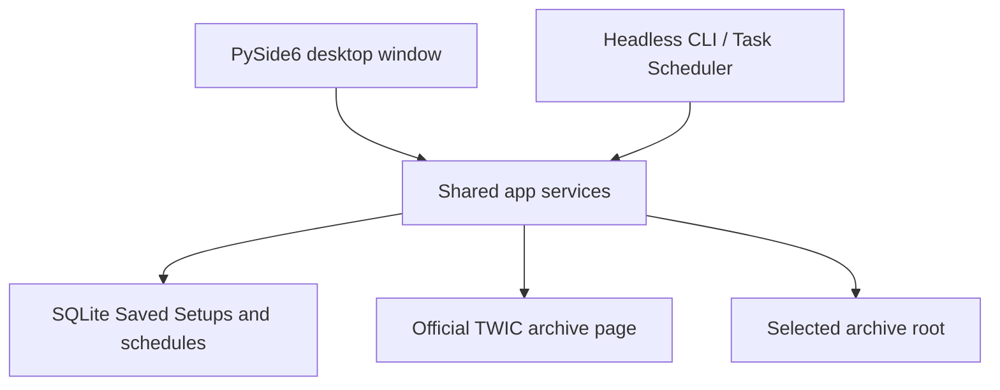

# Architecture

TWIC Archive Manager is a normal Windows desktop program. It does not start a
browser, local server, FastAPI process, or localhost listener.

SQLite holds Saved Setups and schedules in the current user's local
application-data folder. The actual ZIPs and extracted files are the source of
truth for completed downloads and extractions.

The window and the CLI call the same services. Starting the program with no
arguments opens the desktop window. Starting it with `sync` or `combine` stays
headless for Windows Task Scheduler.
