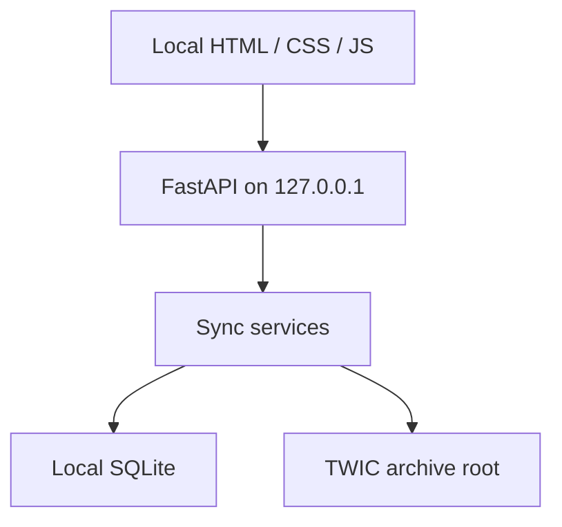

# Architecture

TWIC Archive Manager is a Windows-local FastAPI application. Its browser UI connects only to a server bound to `127.0.0.1`.

SQLite lives under the user's local Windows application-data folder. Archive ZIPs, extracted files, and combined PGNs live in the profile's selected folder, which may be a local path, mapped drive, or UNC share. Keeping SQLite local avoids placing its lock and journal files on a network share.

The UI, CLI, and Windows Task Scheduler use the same Python synchronization services. The finished release is packaged as a self-contained Windows executable.
