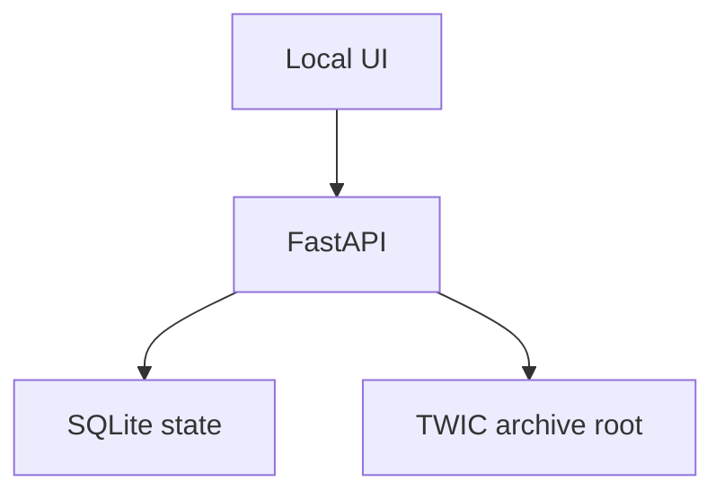

# Architecture

The app serves a local browser interface from `127.0.0.1`.

SQLite holds profiles and artifact state in the user's local application-data folder. ZIPs, extracted files, logs, and the combined PGN live under the selected archive root.

The UI and CLI call the same synchronization services. The packaged application starts locally and opens its interface for the user.
