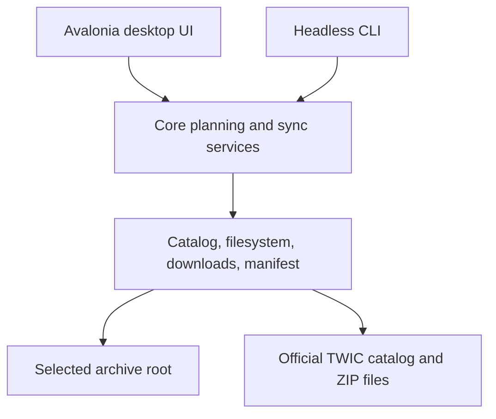

# Architecture

TWIC Archive Manager has a thin Avalonia desktop interface and a separate command-line application. Both call the same core application services.

## Why JSON rather than SQLite

An archive can live on an SMB/NFS network share and be used from both Windows and Ubuntu. A small JSON manifest, written with a same-directory temporary file, atomic replacement, and a backup copy, is more portable for this use than relying on SQLite locking and journal behavior across varied network-share implementations.

The manifest is not a cache of filenames. It is the authoritative record of whether each format was downloaded, verified, extracted, or combined, plus hashes and error information. All stored paths are relative to the archive root.

## Synchronization guarantees

1. Acquire an explicit root lock.
2. Read the official catalog and build a bounded plan.
3. Download each selected artifact to a `.part` file.
4. Verify archive integrity, expected file type, and hash.
5. Atomically commit the ZIP, then record it as verified.
6. Extract through a staging directory with ZIP-slip protection, then atomically commit extraction.
7. Rebuild the combined PGN only from verified managed PGNs.
8. Release the lock, preserve the outcome in logs and the manifest.

The source of truth is the verified artifact state, not merely a file’s existence. A failed, interrupted, or corrupted file is repairable on the next run.

## Boundaries

- `Core`: selection rules, states, profiles, manifest domain models, orchestration interfaces.
- `Infrastructure`: HTTP/TWIC parser, atomic filesystem implementation, hashing, ZIP validation/extraction, manifest persistence, locks, scheduling adapters, logs.
- `App`: Avalonia MVVM, user interaction, progress presentation, folder chooser.
- `Cli`: command parsing, exit codes, configuration/profile selection, text/JSON output as appropriate.

Neither `App` nor `Cli` owns the downloader or decides sync correctness.
